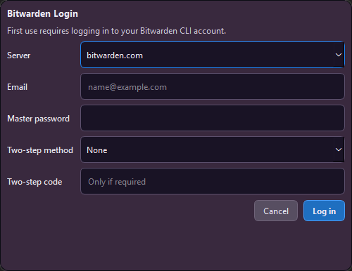
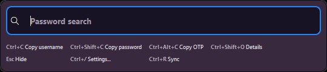
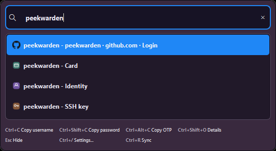
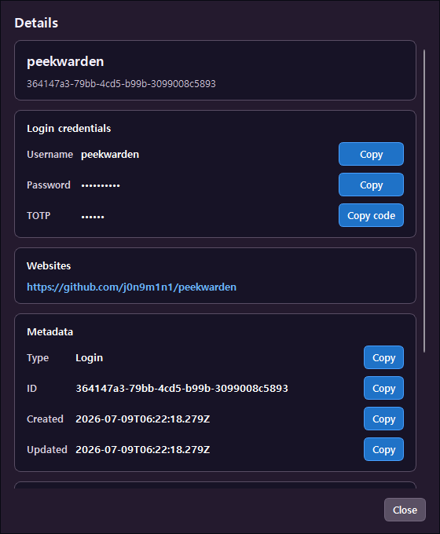
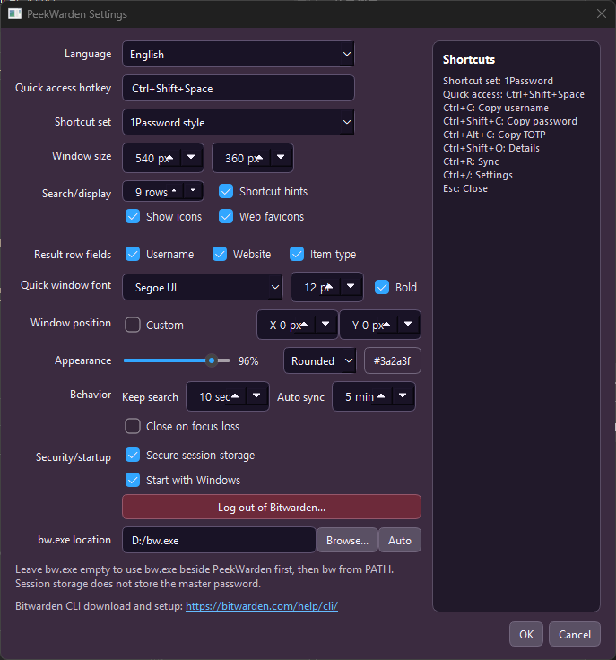

# PeekWarden

[](https://github.com/j0n9m1n1/PeekWarden/actions/workflows/ci.yml)

## References and Acknowledgements

PeekWarden was designed with reference to:

- [1Password Quick Access](https://support.1password.com/quick-access/) and [1Password keyboard shortcuts](https://support.1password.com/keyboard-shortcuts/)
- [Trikzon/quickwarden](https://github.com/Trikzon/quickwarden)
- [ixnas/Quickwarden](https://github.com/ixnas/Quickwarden)

Development was assisted by OpenAI ChatGPT 5.5.

PeekWarden is a small Qt Widgets desktop quick-access app for Bitwarden vault
items. It is inspired by 1Password Quick Access, but uses the Bitwarden CLI
(`bw`) as the backend instead of implementing Bitwarden encryption or APIs
directly.

This project is early Windows-first software.

## Features

- Global quick-access hotkey on Windows.
- Frameless always-on-top search window.
- Bitwarden CLI login and unlock flow.
- Startup preload so unlocked vault items are cached before the search window is opened.
- In-memory search over item names, usernames, URIs, notes, and basic metadata.
- Fast keyboard actions for copying username, password, TOTP, and opening details.
- Type-aware item details for logins, secure notes, cards, identities, and SSH keys.
- Optional web favicon loading for search results.
- System tray menu with open, lock, settings, and quit.
- Settings action to log out of Bitwarden and clear the stored PeekWarden session.
- Configurable hotkey, shortcut preset, quick window size, position, opacity, corner style, theme, font, language, result fields, result count, auto-sync interval, and focus-loss behavior.
- Optional Windows Credential Manager session storage.
- Optional Windows startup registration without administrator rights.

## Screenshots

| Login | Quick access |
| --- | --- |
|  |  |

| Search results | Item details | Settings |
| --- | --- | --- |
|  |  |  |

## Requirements

- Windows 10/11
- Qt 6.11 or a compatible Qt 6 version
- CMake 3.21+
- C++17 compiler
- Bitwarden CLI (`bw`)

PeekWarden first looks for `bw.exe` next to the application executable. If it is
not found there, it falls back to `bw` from `PATH`.

Bitwarden CLI download and setup:
https://bitwarden.com/help/cli/

## Project Structure

- `src/main.cpp` - Application startup, tray setup, and quick window wiring.
- `src/QuickWindow.*` - Quick-access search window, login/unlock UI, result
  list, copy actions, detail view, and favicon loading.
- `src/BwClient.*` - Bitwarden CLI wrapper for status, login, unlock, sync,
  item retrieval, sensitive field lookup, and session handling.
- `src/AppSettings.*` - Persistent settings for hotkeys, UI options, language,
  sync interval, result display, and session storage preferences.
- `src/SettingsDialog.*` - Settings dialog UI and validation.
- `src/WinHotkey.*` - Windows global hotkey registration.
- `src/I18n.*` and `src/TranslationCatalog.cpp` - Runtime text lookup and
  built-in translations.
- `translations/` - Qt translation source files and translation notes.

## Build

Install Qt and the Bitwarden CLI first.

```powershell
cmake -S . -B build -DCMAKE_PREFIX_PATH="C:\Qt\6.11.1\mingw_64"
cmake --build build --config Release
```

If Qt is already discoverable by CMake, the `CMAKE_PREFIX_PATH` argument is not
needed.

## GitHub Release Build

GitHub Actions builds a Windows release package when a version tag is pushed:

```powershell
git tag v0.1.1
git push origin v0.1.1
```

The workflow creates a `PeekWarden-<tag>-win64.zip` package with `PeekWarden.exe`,
Qt runtime DLLs from `windeployqt`, translations, `README.md`, and `LICENSE`, then
attaches it to the GitHub Release. It can also be run manually from the Actions
tab. Use a new version tag for each release.

## Usage

Default quick-access hotkey:

```text
Ctrl+Shift+Space
```

1Password-style shortcut preset:

```text
Ctrl+C          Copy username or primary field
Ctrl+Shift+C    Copy password
Ctrl+Alt+C      Copy TOTP
Ctrl+Shift+O    Open item details
Ctrl+R          Sync vault
Ctrl+/          Open settings
Esc             Close
```

Bitwarden-style shortcut preset:

```text
Ctrl+Enter      Copy username
Enter           Copy password
Alt+T           Copy TOTP
Ctrl+Shift+O    Open item details
Ctrl+R          Sync vault
Ctrl+/          Open settings
Esc             Close
```

## Security Notes

- The master password is never stored by PeekWarden.
- PeekWarden uses `bw login` and `bw unlock --raw` to obtain a Bitwarden CLI
  session.
- Vault item fields needed for quick search and copy are cached in memory while
  the app is running.
- In-memory vault data is cleared when the vault is locked or the app exits.
- Passwords and TOTP codes copied to the clipboard are cleared after 30 seconds if
  PeekWarden still owns the same clipboard content.
- Sensitive clipboard entries opt out of Windows clipboard history and cloud sync.
- TOTP secrets and passwords are not written to PeekWarden settings.
- Optional Windows Credential Manager storage persists the Bitwarden CLI session
  key, not the master password.
- Logging out runs `bw logout`, clears in-memory vault data, and removes the
  stored PeekWarden session.

## Current Limitations

- Windows is the primary target.
- macOS/Linux global hotkey support is not implemented yet.
- Multi-account support is not implemented yet.
- The app depends on the Bitwarden CLI being installed and logged in/unlocked.
- Vault items are cached in memory for fast searching.
- YubiKey, passkey, and other hardware security key authentication flows have
  not been tested yet.

## Status

This is a personal prototype and should be treated as preview software.

## License

PeekWarden application source code is licensed under the MIT License. See
[LICENSE](LICENSE).

PeekWarden currently links against Qt Widgets, Qt Concurrent, and Qt Network.
Qt is not relicensed by this project. When distributing Windows builds made with
open-source Qt, PeekWarden should use Qt as dynamically linked DLLs and include
the notices, license texts, and source-code access or written offer required by
the applicable Qt/LGPL terms. Users must be able to replace the Qt DLLs with
compatible versions.

This project does not currently use Qt modules that Qt documents as GPL-only.
If that changes, or if Qt is statically linked, the distribution requirements may
change significantly.

This is not legal advice.
